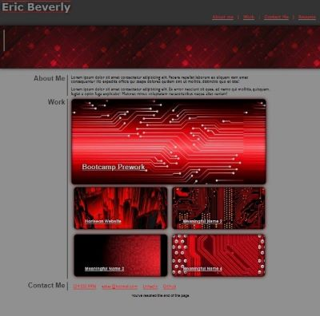
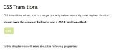

# Module 2 Challenge - Personal Portfolio

## Description

Here I built a website to use as a portfolio to display my work to potential employers. This project was used as a learning experience to take an idea and translate that idea into a website using html and css for formatting and design. This website gives me a current base to display my work as I continue through the bootcamp course and gave me invaluable experience using css and html.

## Table of Contents
- [Website Preview](#website-preview)
- [Credits](#credits)
    - [CSS Snippets Bootcamp Exercise](#css-snippets-bootcamp-exercise)
    - [Adobe Stock Photos](#adobe-stock-photos)
    - [CSS Transitions](#css-transitions)
- [Special Thanks](#special-thanks)
- [License](#license)

## Website Preview

[Personal Portfolio](https://esbev.github.io/module-2-challenge/)

## Credits

NOTE: Click on a thumbnail to view source

- ### CSS Snippets Bootcamp Exercise

    

- ### Adobe Stock Photos

    

- ### CSS Transitions

    

## Special Thanks

Thanks goes out to all the instructors and teacher assistants for their clear instruction and prompt and thorough answers to all my questions. Also, to all the students who joined in the study groups for their active participation and alternative perspectives. I was able to gain multiple insights I otherwise may not have gained towards the project without them. There is always strength in numbers.

## License

MIT License

Copyright (c) 2023 Eric

Permission is hereby granted, free of charge, to any person obtaining a copy
of this software and associated documentation files (the "Software"), to deal
in the Software without restriction, including without limitation the rights
to use, copy, modify, merge, publish, distribute, sublicense, and/or sell
copies of the Software, and to permit persons to whom the Software is
furnished to do so, subject to the following conditions:

The above copyright notice and this permission notice shall be included in all
copies or substantial portions of the Software.

THE SOFTWARE IS PROVIDED "AS IS", WITHOUT WARRANTY OF ANY KIND, EXPRESS OR
IMPLIED, INCLUDING BUT NOT LIMITED TO THE WARRANTIES OF MERCHANTABILITY,
FITNESS FOR A PARTICULAR PURPOSE AND NONINFRINGEMENT. IN NO EVENT SHALL THE
AUTHORS OR COPYRIGHT HOLDERS BE LIABLE FOR ANY CLAIM, DAMAGES OR OTHER
LIABILITY, WHETHER IN AN ACTION OF CONTRACT, TORT OR OTHERWISE, ARISING FROM,
OUT OF OR IN CONNECTION WITH THE SOFTWARE OR THE USE OR OTHER DEALINGS IN THE
SOFTWARE.